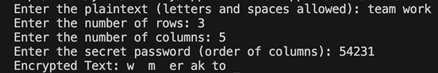
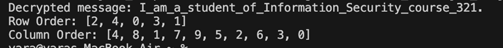
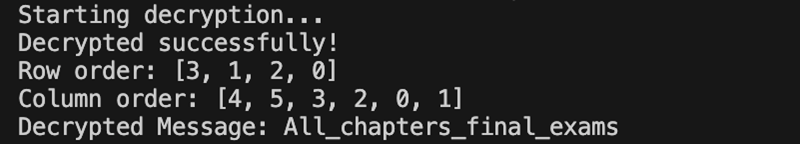

# Information Security Project: Double Transposition Cipher Hacking

This repository contains the Java implementation for the Information Security Project, focusing on the **Double Transposition Encryption** algorithm and cryptanalysis (hacking).

---

## Task #1: Secure Communication through Encryption

**Objective:** Implement the Double Transposition Encryption algorithm in Java.

| Component | File | Description |
| :--- | :--- | :--- |
| **Implementation** | **`Task1_Encryption.java`** | Program to encrypt plaintext using user-provided rows, columns, and a column order password. |

### Encryption Process Summary:
1. **Input:** User provides **Plaintext**, **Number of Rows**, **Number of Columns**, and the **Secret Password** (column order).
2. **Matrix Creation:** The plaintext (with spaces removed and padding added) is filled into an $R \times C$ matrix row-by-row.
3. **Transposition:** The matrix columns are transposed based on the numerical order specified in the secret password.
4. **Output:** The final encrypted text is read column-by-column in the order defined by the password.

### Task #1 Output

---

## Task #2: Hacking an Encrypted Message (Known Dimensions)

**Objective:** Decrypt a message encrypted with Double Transposition when the **dimensions ($R \times C$)** are known, but the **Row** and **Column Orders** are unknown.

| Component | File | Description |
| :--- | :--- | :--- |
| **Implementation** | **`Task2_Hack_Known_Dimensions.java`** | Java program that systematically attempts all possible row ($5!$) and column ($10!$) permutations to find the correct key. |

### Cryptanalysis Summary

* **Encrypted Message:** `_rinftomoa.r31o_2sueua_tIasm__cct_SiyuernnfIdo_te_`
* **Target Decrypted Message:** `I_am_a_student_of_Information_Security_course_321.`
* **Known Dimensions:** **Rows** ($R$) = 5 and **Columns** ($C$) = 10.

### Key Combinations Tested
* **Total Combinations:** $R! \times C! = 5! \times 10!$
* **Number Tested:** **435,456,000**

### Successful Key
| Key Component | Order (0-based Index) |
| :--- | :--- |
| **Row Order** | `[2, 4, 0, 3, 1]` |
| **Column Order** | `[4, 8, 1, 7, 9, 5, 2, 6, 3, 0]` |

### Task #2 Output

---

## Task #3: Hacking a Hard Encrypted Message (Unknown Dimensions)

**Objective:** Decrypt a message where **both the dimensions ($R \times C$) and the keys** are unknown.

| Component | File | Description | |
| :--- | :--- | :--- | :--- |
| **Implementation** | **`Task3_Hack_Unknown_Dimensions.java`** | Java program that checks permutations for all possible dimensions ($4 \times 6$ was the correct one) that factor the message length. |

### Cryptanalysis Summary
* **Encrypted Message:** `msax_ersetapalni_fch_lAl`
* **Target Decrypted Message:** `All_chapters_final_exams`
* **Message Length:** 24 characters.
* **Possible Dimensions ($R \times C$):** $1 \times 24$, $2 \times 12$, $3 \times 8$, **$4 \times 6$**, $6 \times 4$, $8 \times 3$, $12 \times 2$, $24 \times 1$.

### Key Combinations Tested
* **Dimension Tested:** **$4 \times 6$**
* **Total Combinations:** $4! \times 6!$
* **Number Tested (for $4 \times 6$):** **17,280**

### Successful Key
| Key Component | Order (0-based Index) |
| :--- | :--- |
| **Row Order** | `[3, 1, 2, 0]` |
| **Column Order** | `[4, 5, 3, 2, 0, 1]` |

### Task #3 Output

